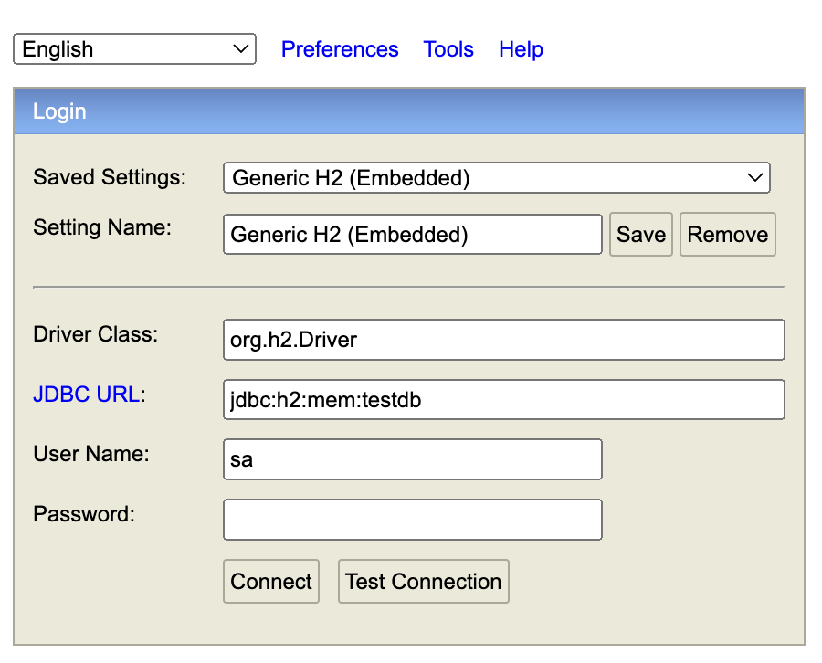

# REST API Modelling Store Application 🛍️

# Endpoints 📍
* ## Product ⌚️
  * GET ```/product/```
  * GET ```/product/{id}```
* ## Customer 🧔🏻‍♂️
  * GET ```/customer/```
  * GET ```/customer/{id}```
  * POST ```/customer/signup```
  * POST ```/customer/login```
* ## Cart 🛒
  * GET ```/cart/```
  * POST ```/cart/```
  * DELETE ```/cart/{cartItemId}```
  * PUT ```/cart/```
* ## Checkout 🧾
  * GET ```/checkout/```

# How To Use ℹ️
Please find below the expected way for the program to work and how 
to interact with it:
1. Register new user. Example request: {“email”:”my@email.com”, “password”:”123”}.
   Responds with an appropriate HTTP codes (200 for ok, 409 for existing user).
2. Login into system. Example request: {“email”:”my@email.com”, “password”:”123”}
   Responds with JSON containing sessionId.
3. Get all products in store.
   Respond with JSON list of items you have, e.g.:
   {“id”:”2411”, “title”:”Nail gun”, “available”:8, “price”: “23.95”} 
4. Add item to cart. Example request: {“id”:”363”, “quantity”:”2”}
   Allows adding only one position at a time. If you don’t have this quantity in store - responds with an error. 
   The information is session-scoped: once session expires - user gets new empty cart.
5. Displays your cart content.
   Responds with list of product names with their quantities added. Calculates subtotal.
6. Remove an item from user’s cart.
7. Modify cart item. Example request: {“id”:2, quantity: 3}.
8. Checkout: ensures you still have desired amount of goods. 
   If all is good - sends a user confirmation about successful order.

# Database Access 📚
Application is using Spring's H2-in memory database. In order to access it, just open 
```localhost:8080/h2-console``` in your browser with the following credentials:

